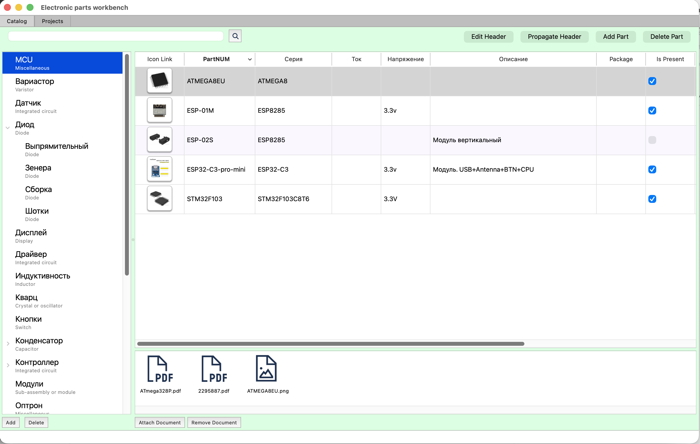
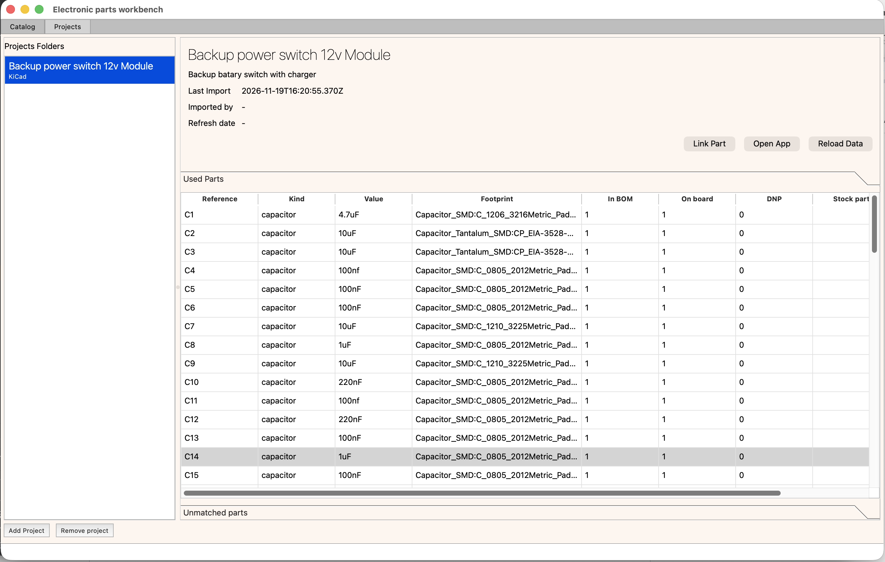
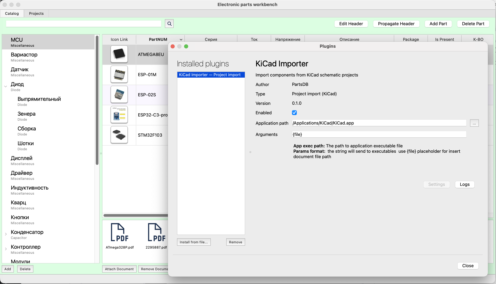

# PartsDB 2.0

[Русская версия](README.ru.md)

PartsDB (window title: *Electronic parts workbench*) is a small desktop application for cataloguing
electronic components and their datasheets. It is written in Python with PyQt6 and keeps everything
in a single SQLite file.



Version 2.0 adds KiCad project imports, plugin management, editable SI units and
basic component types, and external project application launch. Database schema: **9**.
See the [2.0 changelog](CHANGELOG.md#20--2026-11-21).

## Features

- **Interface language.** **Setup → Language → English / Русский / System** switches the interface
  without restarting, including open dialogs. The choice is saved in the config. Custom section names,
  part data and renamed column titles are not translated.
- **Section tree.** Parts are grouped into a tree of types and subtypes of any depth,
  for example `Транзистор / MOSFET / N-Канал` or `Диод / Шоттки`.
  Sections are added, renamed and deleted with the buttons under the tree and its context menu.
- **Parts table.** Selecting a section shows its parts in a table with a set of predefined fields
  (part number, body marking, value, units, current/power, voltage, package, description, quantity, in stock, …).
  Columns are configured per section: they can be renamed, hidden, shown again and aligned from the
  column header context menu or in **Setup → Edit headers**.
  Columns without saved settings inherit them from the nearest ancestor with settings for that column,
  falling back to built-in defaults. Editing an inherited column saves an override for the current section.
- **Part pictures.** The *Icon Link* column shows a picture of the part with a larger preview in the tooltip.
  Parts without their own picture get a default icon chosen by section and package (SMD or through-hole).
- **Search** across all parts from the search field above the table. A found part can be opened in its own section.
- **Adding, deleting and moving parts.** *Add Part* and the table context menu add and delete parts.
  *Delete Part* asks for confirmation, removes the selected part and its document links,
  and deletes its icon from the icons folder. Document files remain on disk.
  Parts with legacy project links cannot be deleted. For imported-project matches, confirmation
  removes the matches while keeping the project positions for another stock selection.
  Drag selected rows onto another section in the tree to move them there.
- **Documents.** Every part has a list of linked documents: datasheets, schematics, images, KiCad files or
  web links. Add them with *Attach Document* or by dragging a file from Finder or a URL from the browser onto
  the document area. Double-click opens a document in the application configured for its file extension
  (**Setup → Docs open exe**).
- **Several databases.** **File → Open DB** (`Ctrl+O`) and **File → Create new DB** (`Ctrl+N`).
  Creating a database opens a file chooser, creates an empty SQLite database and switches to it.
  Existing files are never overwritten. Add sections and parts to start filling the new inventory.

- **Projects and KiCad import.** Install the KiCad importer wheel through **Setup → Plugins...**,
  then add a project on the **Projects** tab. Preview the component list before saving it.
  Repeat imports preserve existing stock matches and mark changed requirements for review.
  Importing never changes stock quantities; confirmed matches can be managed from the component context menu.
- **Plugin management.** Install and update from wheel, replace an importer for the same external system,
  enable/disable or remove it, and view its log. Plugins run in separate Python environments and processes.
  The standalone application needs an installed Python 3.9+ to create plugin environments.

- **Units and basic types.** **Setup → Units and basic types...** edits the SI unit and
  component type references. Each prefixed unit points to its base unit; a component type
  can have a base unit or no unit. Deletions require confirmation; Save commits both tables
  together and Cancel discards edits. [Reference editor and schema](docs/units-and-project-applications.md).
- **Open projects in an external application.** Set the application path and arguments for
  an importer in **Setup → Plugins...**, then use **Open App** on its project. `{file}` is
  replaced with the project source path. The application keeps running after PartsDB closes.




## Installation

You need Python 3.11 or newer (the current build uses Python 3.14).

```bash
git clone https://github.com/abel-msk/PartsDB
```

```bash
cd PartsDB
```

A virtual environment is strongly recommended
(see https://docs.python.org/3/library/venv.html):

```bash
python3 -m venv venv
```

```bash
source venv/bin/activate
```

Install the dependencies:

```bash
pip install PyQt6 PyYAML pyinstaller
```

| Package      | Purpose                                                        |
|--------------|----------------------------------------------------------------|
| PyQt6        | GUI                                                            |
| PyYAML       | configuration file                                             |
| pyinstaller  | building the standalone application                            |
| openpyxl     | only for `ELImport.py` (one-off import from an Excel list)     |
| PySide6      | optional: needed only to regenerate UI/resources (`./build.sh -u`); skip it if you do not plan to edit or regenerate the UI |

UI forms are edited in **Qt Designer**. PySide6 is a Python package and is not required to open or edit forms in Qt Designer; install it only when regenerating the Python UI/resource files.

### Building the application

```bash
./build.sh -b
```

Use `./build.sh -u` to regenerate the UI and Qt resources, `./build.sh -t` to run
all unit tests, or `./build.sh -tb` to test and then build. `./build.sh -a` runs
the full pipeline: regenerate UI, run tests, then build. The build stops if any
test fails.

Plugin sources are in `ElPartsPluginSrc/kicad`.
The SDK defines `project_import`, `parts_order` and `shipment_tracking` types.
Each plugin declares its type in the manifest and `get_plugin_type()`; it is
validated before use and stored in SQLite `PLUGINS` (current database schema: 9).


Use `./build.sh -p` to build the KiCad plugin wheel in `dist/plugins/`, or
`./build.sh -tp` to run all tests before building the plugin. The `-p` option
is independent of application builds (`-b` and `-a`).
Use `./build.sh -tpb` to test, clean test databases, then build the application and plugin.
Building wheels requires pip and setuptools with `bdist_wheel` support (or the wheel package).
Installation and project imports: [runtime guide](docs/plugin-runtime.md).

PyInstaller creates `dist/ElPartsDB` and, on macOS, `dist/ElPartsDB.app`.
Copy the `.app` to `/Applications`.

The application icon is `icons/ElPartsCatalog.icns`; the window icon is `icons/main1.png`.

## Running

```
ElPartsDB [-c CONFIG] [-d DBFILE] [-l LOGFILE] [-v]

  -c, --config   Path to the configuration file
  -d, --dbpath   Path to the SQLite database file
  -l, --logfile  Path to the log file. All stderr output is also copied there
  -v, --verbose  Debug-level logging. Without it only errors and critical messages are logged
```

### Configuration and data

- The installed application reads `~/.elworks/elworks.conf` (YAML). The folder is created on first start.
- `main.db_file` is the database. A relative path is resolved against `main.data_path`
  (by default the folder of the configuration file). Without `db_file` the application looks for
  `elworks.sqlite` in the data folder and in `~/.elworks`.
- Part pictures are stored in the icons folder inside the data folder. It is created if missing.
- `main.log_level` is `err` or `debug`, `main.log_file` is the log path (default `/tmp/elworks.log`).
- `main.language` is `system` (default), `en` or `ru`. Unsupported system languages fall back to English.
- Window size and position and the applications used to open documents are saved to the same file on exit.

Example:

```yaml
main:
  data_path: ~/.elworks
  db_file: elworks.sqlite
  log_level: err
  language: system
application_PDF_View:
  ext: pdf
  exec: /System/Applications/Preview.app
  args: '{file}'
```

## Development

Run from the sources:

```bash
python main.py -c tests/elworks.test.conf -v
```

When started from the sources without `-c`, the application uses `tests/elworks.test.conf`,
so it never touches the working database in `~/.elworks`. The test databases (`tests/*.sqlite`)
are not stored in git: put a copy of your database into `tests/` and point `db_file` in
`tests/elworks.test.conf` to it.

### Project layout

| File                                        | Contents                                                  |
|---------------------------------------------|-----------------------------------------------------------|
| `main.py`                                   | entry point: options, configuration, database, logging    |
| `ElMainWindow.py`                           | main window, menus, drag and drop                         |
| `ElTypesTree.py`                            | section tree                                              |
| `ElPartsTable.py`                           | parts table, column menus, search                         |
| `ElIconDelegate.py`, `ElDefaultIcons.py`    | part pictures in the table and default icons              |
| `ElIconListWidget.py`                       | list of part documents                                    |
| `ElData/ElDBConnect.py` | SQLite connection, transactions and system metadata |
| `ElData/ElDBScheme.py`                             | database schema and access (`DBFactory`, `Type`, `Part`, …) |
| `ElConfig.py`, `constants.py`, `ElConstants.py`               | configuration file and its keys                           |
| `ElAppList.py`, `ElAppPathDialog.py`, `ElProcess.py` | applications for opening documents               |
| `ElUnitsDialog.py`, `ElData/ElDBDataUnits.py` | SI unit and basic component type reference editor |
| `ElHdrEditDialog.py`                        | column header editor                                      |
| `ELImport.py`                               | import from an Excel list                                 |
| `ElPartsPluginSrc/kicad/`                   | KiCad importer sources, manifest and wheel configuration |
| `ElPartsPluginApi/`                        | public importer models, manifest and runtime context     |
| `ElPluginMgr/`                           | installation, registry, worker protocol and atomic project storage |
| `ElPluginsDialog.py`, `ElPluginMgr/ElProjectImports.py`, `ElImportTask.py`, `ElImportPreview.py` | plugin and import workflow |
| `ElProjList.py`, `ElProjWindow.py`          | projects, imported positions and stock matches           |
| `tests/input/`, `tests/kikad_plugin/`       | local KiCad fixture, parser, lifecycle, DB and UI tests   |
| `tools/cleanup_test_databases.py`           | successful-run cleanup and failed-run backup rotation    |
| `qt/*.ui`, `qt/resources.qrc`               | Qt Designer forms and resources                           |

### Changing the UI

Forms are edited in Qt Designer (`qt/*.ui`). The generated files `ElParts.py`, `ElAppPathWnd.py`,
`ElOpenFileWnd.py`, `ElHdrEditWnd.py`, `ElPluginsWnd.py`, `ElUnitsWnd.py` and `resources.py` must not be edited by hand. Regenerate them:

```bash
./updateui.sh
```

Generated files contain only generator output. Do not add edits, comments or docstrings,
including through postprocessing scripts; class and method documentation rules apply to handwritten code.

### Tests

```bash
./build.sh -t
```

The tests use the test database in `tests/` and the offscreen Qt platform.

`./build.sh -t` removes the root scratch database `test_db.sqlite` (including
SQLite sidecars) and test database backups directly in `tests/` after all tests
pass. Failed runs retain the scratch DB and the three newest backups per database.
The source `tests/imported.sqlite`, input data and archived fixtures are preserved.
For direct unittest runs, use `python tools/cleanup_test_databases.py --success`
after success or `--failed` after failure.

### Plugin documentation

- [Installation, imports, configuration and test cleanup](docs/plugin-runtime.md).
- [Architecture and public API](docs/plugin-architecture-and-api.md).
- [Plugin manager and Projects UI](docs/plugins-ui.md).
- [SI references and external project applications](docs/units-and-project-applications.md).
- [All database tables and reference data](docs/database-schema.md).
- [Database migrations](docs/database-migrations.md).
- [KiCad importer and API output examples](docs/kicad-importer.md).
- [KiCad importer sources and commands](ElPartsPluginSrc/kicad/README.md).

### Database access rules

Application SQL is implemented in `ElData/ElDBScheme.py`. SQLite connections,
transactions, PRAGMA and system metadata are handled by `ElData/ElDBConnect.py`.
Tests may use SQLite directly; the root `connector.py` has been removed.
UI and import services call the database layer. [SQLite driver methods](docs/sqlite-driver.md).
Further data-module naming, constants and class/method documentation rules are
recorded in [AGENTS.md](AGENTS.md). Existing data classes and general constants
will be moved only on a separate request.

### Translations

Qt translation catalogs live in `translations/partsdb_en.ts` and `translations/partsdb_ru.ts`.
Source strings are English; `.qm` files are included for running from source. Translate Python strings
with `translate("PartsDB", "Source text")`; mark action captions and default column titles with
`QT_TRANSLATE_NOOP("PartsDB", "Source text")`. Window captions and labels are applied in
`ElWindowTexts.py`, with a separate function for each window called during initialization and on
language changes. Edit this module for bilingual window texts; never edit Python files generated
by `updateui.sh`. Designer layout sources remain in the `.ui` forms.

```bash
python tools/translations.py --update
# Edit the .ts files with Qt Linguist, then:
python tools/translations.py --check --compile
```

Compilation requires Qt Linguist's `lrelease` (or `pyside6-lrelease`) on PATH or in Qt's binary folder.
`build.sh -b` checks and compiles the catalogs and bundles them together with Qt's Russian standard-dialog
translations. The extractor supports Python 3.14, where pylupdate6 6.10.0 still relies on removed AST APIs.

Catalog matching keys, basic component types, shared list rendering and persisted
project table widths: [catalog and layout documentation](docs/catalog-keys-and-layout.md) (Russian).
